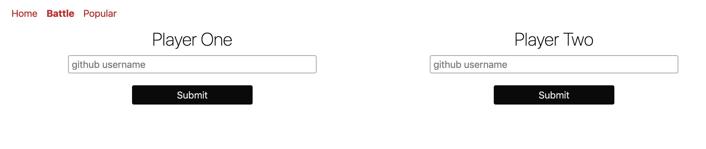
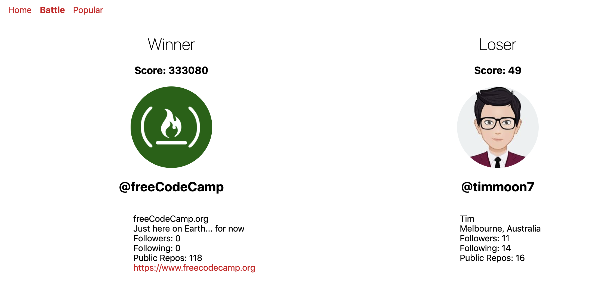
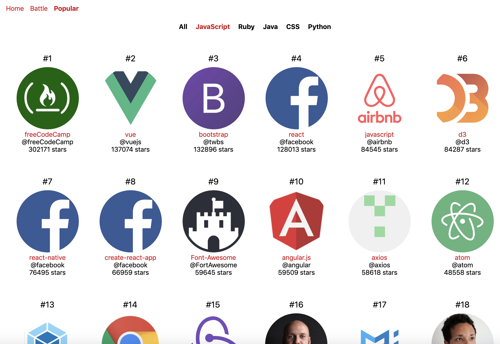

# Github Battle and Popular Repositories

This App provides us to battle with 2 Github users.
Also, it shows us popular repositoires of All, JavaScript, Ruby, Java, CSS, and Python.

## API from Transport for London Unified

The APIs (endpoints) are here:

- getProfile: https://api.github.com/users/${username}${params}.
- getRepositories: https://api.github.com/users/${username}/repos${params}&per_page=100

## Development & Deployment

- ReactJS App.
- This App has been deployed on Firebase server.

## Front-end

https://github-battle-da289.firebaseapp.com/  
https://github.com/timmoon7/github-battle

### Battle Page

### Popular Page

